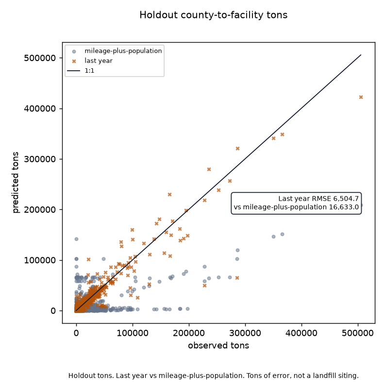
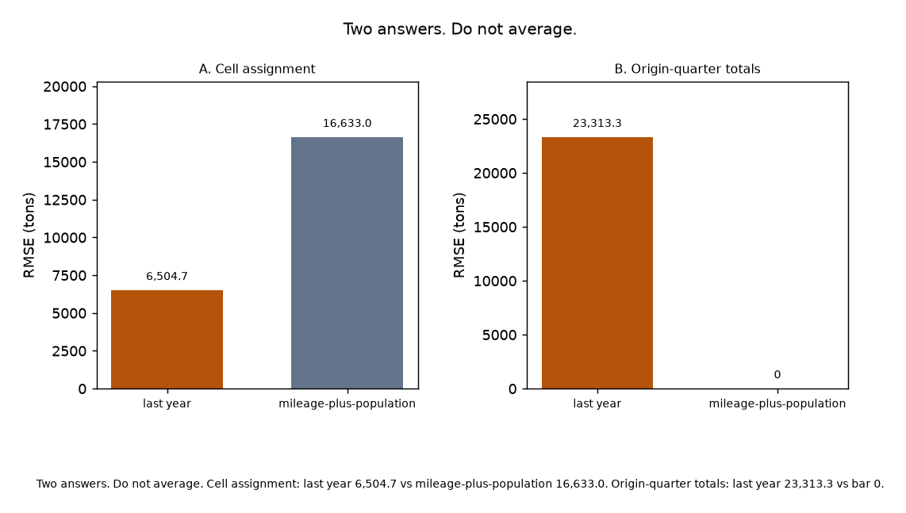

# Indiana last-year Re-TRAC shipments vs mileage-plus-population

Do last year’s Re-TRAC county-to-facility shipments beat a mileage-plus-population assignment on held-out quarters?

Yes on origin-facility-quarter cells. Locked `5800fc3`. Holdout last-year RMSE is 6504.7 tons against mileage-plus-population 16633.0 on the 4370 cells where last year is present. MAE is 1144.0 against 4455.3. Last year misses origin totals: origin-quarter RMSE 23313.3 tons against 0.0 for the bar, which is scaled to the observed county total. That split is the product. Do not average it away. Origin population cancels inside each county’s shares; the miles term is the assignment. Confirmation 2025 last-year RMSE 8059.0 against 16227.2 does not reverse the holdout. Fixture skill does not rescue live. Three 2024-only facilities get bar mass 0.

Science lock: public IDEM waste-received XLSX 2021 through 2025 (`e4a8ece1b09c…`). Not a live Re-TRAC login. Facility set J is 152 train-era receivers. 97 facilities sit on IndianaMap coordinates; 60 use the host-county centroid.

Holdout n=5754 origin-facility-quarter cells (2024 Q1 through Q4). Train: 2021 Q1 through 2023 Q4. Confirmation 2025 is out of train and out of J. 92 Indiana origin counties. 31965 out-of-state source rows dropped from the lead.



Figure 1. Holdout tons. Last year RMSE 6504.7 vs mileage-plus-population 16633.0. Tons of error, not a landfill siting.



Figure 2. Holdout RMSE in tons. Largest origin counties. County error, not a hauling route.

## Live skill (held-out quarters)

Locked from `logs/in_live/stage_c_report.json`. RMSE in tons. 7/N counts are not the method.

| Universe | Last year RMSE | Bar RMSE | n |
|----------|---------------:|---------:|--:|
| Intersection cells (last year present) | 6504.7 | 16633.0 | 4370 |
| All reported holdout cells | | 14914.5 | 5754 |
| Origin-quarter totals | 23313.3 | 0.0 | 368 |

### Largest origins (holdout RMSE, tons)

| Origin | Last year | Mileage-plus-population | Holdout tons | n |
|--------|----------:|------------------------:|-------------:|--:|
| Marion | 10534 | 45659 | 3404326 | 150 |
| Lake | 10981 | 49904 | 2165375 | 103 |
| Porter | 29585 | 33284 | 1581568 | 93 |
| Gibson | 15597 | 76281 | 1540946 | 35 |
| Vermillion | 9362 | 39897 | 770947 | 31 |
| Hamilton | 4041 | 14689 | 707353 | 92 |
| Elkhart | 9252 | 21294 | 684880 | 80 |
| Allen | 1796 | 19596 | 624664 | 87 |
| Tippecanoe | 3056 | 7287 | 480836 | 86 |
| Floyd | 10278 | 18890 | 448111 | 44 |
| Sullivan | 20408 | 25009 | 444983 | 29 |
| St. Joseph | 1617 | 11105 | 428236 | 70 |

### Indiana-origin tons by type, 2021 through 2025 (footnote)

| Type | Tons |
|------|-----:|
| Municipal Solid Waste | 52967574 |
| Other Non-Municipal | 19193390 |
| Flue Gas Desulfurization Waste | 9473724 |
| Coal Ash | 7491794 |
| Construction/Demolition | 6239801 |
| Alternate Daily Cover/Reuse | 5888085 |
| Foundry | 3433002 |

Types are pooled in the lead.

## Stage 0

Synthetic counties with planted last-year persistence. Fixture skill does not rescue live.

```bash
python3.12 -m venv .venv
source .venv/bin/activate
pip install -r requirements.txt
PYTHONPATH=src:. python3 scripts/run_fixture.py logs/stage0_fixture
.venv/bin/python -m pytest tests -q
PYTHONPATH=src:. python3 scripts/run_live.py logs/in_live data/raw
```

Empty IDEM XLSX, unmatched origin county, or missing facility coordinates stops (`run_live.py` exit 2). Two figures max.

| File | Role |
|------|------|
| [METHODOLOGY.md](METHODOLOGY.md) | Locked contract |
| [AGENTS.md](AGENTS.md) | Agent rules |
| [CHECKLIST.md](CHECKLIST.md) | Operator list |
| `src/retrac/` | XLSX join, inverse-miles bar, last year, figures |
| `retracforge/` | GraphForge pin |
